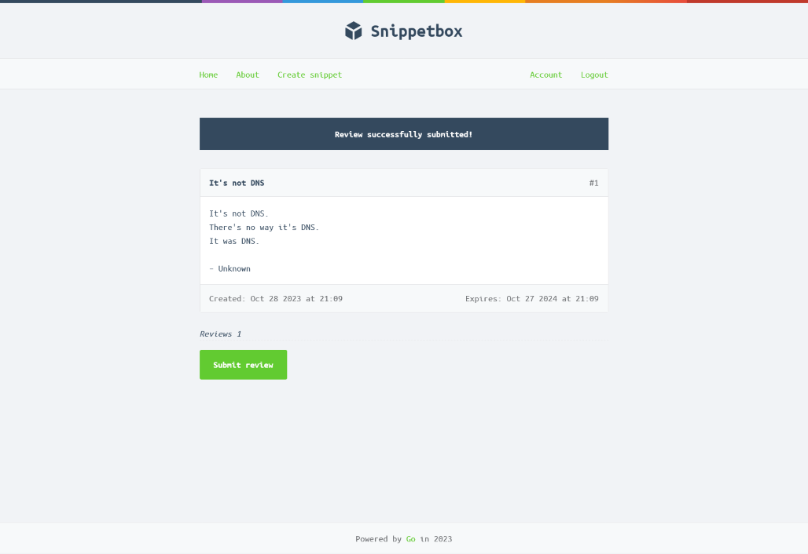

# Reviews

With the Snippetbox web application packaged and deployable, I can begin adding features.

The `reviews` branch adds a small feature that builds upon key parts of the code base.
The [cloud resume challenge](https://cloudresumechallenge.dev/docs/the-challenge/aws/) describes a static website with a
visitor counter to demonstrate interaction with a backend database. The Snippetbox design already includes a backend, so
I have built upon that and added a review submission counter. This addition reflects the day-to-day work of contributing
to an existing code base and adds my own feature to the backend.

I have followed the model structure of the application and added a Review model along with some mock data and a test.
The `reviews` table I created for reviews has a composite key consisting of foreign key IDs from the `users`
and `snippets` tables. Accordingly, the `reviewUpdatePost` handler builds off the design of the other handlers requiring
both a user and snippet ID to execute. For the `reviews.Update` method, I created a transaction to lock the row for
update in case multiple reviewers are using the same login to review.

The `reviews` branch builds and runs. A user needs to be logged in to submit a review.

